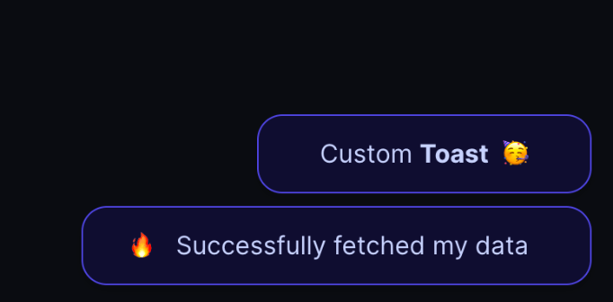

# React Hot Toast

This is an example of how to use and customize the [react-hot-toast](https://react-hot-toast.com/) notification library

> Note: Check [react-toastify](https://github.com/emanuelefavero/react-toastify) for another toast notification library for react

## Demo

- [https://react-hot-toast-five.vercel.app/](https://react-hot-toast-five.vercel.app/)

#### Screenshot



## Run App

- clone the repo and `cd` into it
- run:

```bash
npm i
npm run dev
```

## Resources

- [react-hot-toast](https://react-hot-toast.com/)
- [react-hot-toast Documentation](https://react-hot-toast.com/docs)
